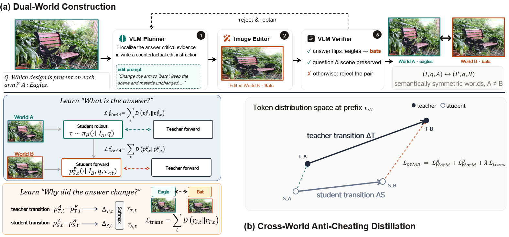

# CWAD: Cross-World Aligned Distillation

Counterfactual worlds as a supervision signal. CWAD trains a vision-language
student on **two images of the same scene that disagree about the answer** -- the
original (world A) and a single-local-edit counterfactual (world B) -- and
distills not only *what* the teacher answers in each world but *how its answer
moves* between them. A student that copies the answer can score well on either
world; a student that copies the transition has to know which pixels carry the
evidence.



## Method

### (a) Dual-world construction

Each sample starts as an ordinary VQA row `(I, q, A)`.

1. **VLM planner** looks at the original image, the question, the options and the
   ground truth, localizes the answer-critical evidence, and picks one distractor
   `B` that a *single local edit* can make true -- then writes the English editing
   instruction for it, naming what is currently in the image, what to change it
   into, and what must stay unchanged.
2. **Image editor** applies that instruction to `I`, producing world B.
3. **VLM verifier** accepts the pair only if the answer flips (`A -> B`) *and* the
   question plus the non-critical scene context survive. Otherwise the row is
   rejected and sent back to the planner for a rewritten instruction.

The surviving pair is `(I, q, A) <-> (I', q, B)`: two semantically symmetric
worlds over one question, with `A != B`. The exact prompts of all three stages,
and the JSON each one returns, are in
[`scripts/cwbench_prompts.py`](scripts/cwbench_prompts.py) -- run it to print
them.

### (b) Cross-world anti-cheating distillation

The student samples a rollout `tau` in world A. Both student and teacher then
re-score that same prefix under **both** images, giving four distributions per
step: `p^A_S, p^B_S, p^A_T, p^B_T`.

*World term -- learn what the answer is.* Match teacher and student inside each
world separately:

```
L_world = sum_t D(p^A_{S,t} || p^A_{T,t}) + sum_t D(p^B_{S,t} || p^B_{T,t})
```

*Transition term -- learn why the answer changed.* Center each distribution's log
probabilities (so only the *shape* of the belief, not its absolute scale, is
compared), take the cross-world difference, and soften it into a transition
distribution:

```
phi(p) = log p - mean(log p)
Delta_{S,t} = phi(p^A_{S,t}) - phi(p^B_{S,t})        Delta_{T,t} = same, teacher
r_{S,t} = softmax(Delta_{S,t} / tau)                 r_{T,t} = softmax(Delta_{T,t} / tau)
L_trans = sum_t D(r_{S,t} || r_{T,t})
```

The student is asked to reproduce the teacher's *movement* between the two
worlds, which is the part of the teacher's behaviour that cannot be imitated by
pattern-matching the question. The objective is

```
L_CWAD = L_world^A + L_world^B + lambda * L_trans
```

`lambda` weights the transition term and `tau` is its softmax temperature; both
are set in [`config/best.env`](config/best.env) (`CWAD_LAMBDA`, `CWAD_TAU`). The
loss, its bias-corrected KL and the per-term diagnostics
(`cwad_world_a/b_token_mean`, `cwad_trans_token_mean`, ...) are implemented in
`verl/trainer/ppo/core_algos.py::compute_cwad_loss`.

## Results

All rows are **Qwen3.5-4B** students. The last two rows are the two CWAD
variants: **CWAD** distills against a 4B EMA self-teacher (OPSD-style), and
**CWAD (OPD)** distills from a frozen 9B teacher. Bold marks the best value in
each column. The last two columns are not benchmark accuracies but the two
CWBench metrics, defined in
[CWBench: CWPA and CWFR](#cwbench-cwpa-and-cwfr).

| Model | V\*Bench | HR-Bench 4K | RealWorldQA | MMVP | HallusionBench | SEED-Bench | OK-VQA | Avg. | CWPA ↑ | CWFR ↓ |
|---|---|---|---|---|---|---|---|---|---|---|
| Base | 81.15 | 83.00 | 74.38 | 77.67 | 70.42 | 79.25 | 75.17 | 77.72 | 47.64 | 46.13 |
| SFT | 83.50 | 83.75 | 73.30 | 78.67 | 68.03 | 77.72 | 77.42 | 77.48 | 48.57 | 45.38 |
| GRPO | 83.60 | 80.88 | 73.50 | 81.67 | 71.30 | 79.70 | 76.90 | 78.22 | 48.09 | 45.91 |
| OPSD | 84.82 | 84.63 | 78.43 | 79.82 | 73.67 | 78.52 | 78.75 | 79.81 | 60.61 | 33.50 |
| OPD | 82.70 | 83.25 | 76.84 | 79.17 | 68.17 | 80.31 | 76.56 | 78.14 | 49.53 | 44.02 |
| Vision-OPD | 84.10 | 83.90 | 77.20 | 80.00 | 69.90 | 80.55 | 76.80 | 78.92 | 50.33 | 43.47 |
| VAD | 84.54 | 83.67 | 78.32 | 81.13 | 68.43 | **80.79** | **78.93** | 79.40 | 54.32 | 42.57 |
| VA-OPD | 85.69 | 84.32 | 76.29 | 78.67 | 72.34 | 79.96 | 78.33 | 79.37 | 54.27 | 40.96 |
| FP-OPD | 83.67 | 83.50 | 77.80 | 79.33 | 69.50 | 80.60 | 77.30 | 78.81 | 49.05 | 44.36 |
| VGS | 83.40 | 83.30 | 77.10 | 79.00 | 69.20 | 80.40 | 76.90 | 78.47 | 48.81 | 44.71 |
| RP-OPSD | 85.75 | **85.50** | 77.20 | 79.50 | 71.85 | 78.90 | 76.80 | 79.21 | 56.16 | 37.94 |
| **CWAD (OPSD)** | **86.39** | 85.12 | **80.65** | **82.00** | **74.58** | 80.10 | 77.96 | **80.97** | **65.82** | **29.30** |
| **CWAD (OPD)** | 85.25 | 84.78 | 82.43 | 82.00 | 68.72 | 80.68 | 78.76 | 80.37 | 55.44 | 41.26 |

<!-- Avg. is the arithmetic mean of the seven accuracy columns; it reproduces to
     two decimals for eleven of the thirteen rows. Two rows do not: Base (mean of
     its seven columns is 77.29, the row says 77.72) and RP-OPSD (79.36 vs
     79.21). TODO: check those nine numbers against the paper's source; the
     figures are transcribed here as they were given and are not adjusted. -->

## Dataset

The dual-world dataset used for the reported runs is **CWBench**:
<https://huggingface.co/datasets/remake123/CWBench>

Training does not consume that tree directly. `scripts/build_dual_world_data.py`
turns any VQA dataset of the same shape -- one row per sample, with a world-A and
a world-B image path and a directory of counterfactual edits -- into the runtime
parquet the trainer reads (`./run.sh build-data`, or
`./scripts/build_cwad_data.sh --dataset ... --edit-dir ... --output-dir ...`).

The result is `/path/to/build/dual_world.parquet` with absolute image paths, one
row per sample, plus a summary of how many rows got a real edit and how many fell
back to the dataset's own world-B column. Pass `--only-ids-file qc.jsonl` to keep
only rows whose edit passed verification, or `--help` for the layout options.

## Environment

```bash
./run.sh prepare-env --env-dir /tmp/cwad-venv
```

`prepare-env` builds a Python 3.12 virtualenv (override the interpreter with
`--python`), installs [`environment/requirements.lock.txt`](environment/requirements.lock.txt)
with `--no-deps` -- the lock is a `pip freeze`, so every transitive dependency is
already listed and letting pip re-resolve it fails on
`cupy-cuda12x`'s `numpy>=2` against the pinned `numpy==1.26.4` -- then checks the
result against [`environment/versions.json`](environment/versions.json):

| torch | torchvision | transformers | vllm | ray | qwen-vl-utils |
|---|---|---|---|---|---|
| 2.10.0 | 0.25.0 | 5.5.0 | 0.18.0 | 2.53.0 | 0.0.14 |

Two notes on that step:

* **Put `--env-dir` on a local disk.** Over NFS the ~95k small files page fault
  at roughly 100 KB/s and a bare `import torch` takes over seven minutes, which
  looks like a hang. The reported runs used `/tmp/cwad-venv`, which is why every
  example in this README passes `--env-dir` explicitly.
* **`flash-attn` and `causal-conv1d` are optional, and are not in the lock.** The
  box the reported runs trained on had neither a flash-attn build nor an `nvcc`
  to compile one, so attention ran with the scaled-dot-product backend
  (`CWAD_ATTN_IMPLEMENTATION=sdpa` in [`config/best.env`](config/best.env)).
  Pass `--skip-kernels` for the same configuration, or point `FLASH_ATTN_WHEEL` /
  `CAUSAL_CONV_WHEEL` at prebuilt wheels to install them.

Then check the checkout is wired up before spending GPU time on it:

```bash
python3 tests/test_package.py                                 # no GPU, no model
./run.sh verify --model-path <student dir> --data-parquet <build/dual_world.parquet>
```

`verify` is the same gate `scripts/train.sh` runs just before launch -- weights,
hidden size, parquet columns and row counts, image paths -- so a failure there is
reproducible here without starting a training job.

Every later command takes the environment through `--env-dir`, which defaults to
`.runtime/venv` inside this repository: pass `--env-dir /tmp/cwad-venv` to
`train`, `merge`, `eval` and `eval-cwbench` as well when you built it elsewhere
(`verify` reads the `ENV_DIR` variable instead).

## Training

```bash
bash run.sh                            # usage
./run.sh build-data --dataset /path/to/CWBench/train.jsonl --edit-dir /path/to/edits --output-dir /path/to/build
./run.sh train-cwad   --data-parquet /path/to/build/dual_world.parquet
./run.sh train-cwad-hint --data-parquet /path/to/build/dual_world.parquet
```

`train-cwad` is the dual-world recipe (EMA self-teacher); `train-cwad-hint` is
the same objective with an answer-hint privileged teacher, and
`scripts/train.sh` is the shared entry point that verifies the checkpoint and the
data, then launches `verl.trainer.main_ppo`. Cross-model distillation (a frozen
teacher of a different size) is selected by passing `--teacher-model-path`; an
empty value keeps the EMA self-teacher.

Both launchers state the reported Qwen3.5-4B settings explicitly at the top, so
the command behind the table above is readable without opening a config file:

| Group | Setting |
|---|---|
| Optimization & training | AdamW, learning rate `2e-6`, weight decay `1e-2`, constant schedule, 1 epoch (`49` steps = the CWBench train split's 2365 rows over global batch `48`), global batch size `48`, vision encoder unfrozen |
| On-policy rollout | temperature `2.0`, top-p `1.0`, max prompt `8192`, max response `1024` |
| EMA teacher (OPSD) | update rate `0.05` (decay `0.95`), updated every optimizer step, initialized from a frozen copy of the student, buffer never refreshed |
| CWAD | `lambda = 1.0` |

Precedence is shell environment > recipe launcher >
[`config/best.env`](config/best.env). The launcher and the config state the same
recipe values; what only the config holds is the machine-specific part -- model
and dataset paths, the vLLM memory reservations, the image-pixel cap. Re-split the
batch with `--gpus`, and change anything else by exporting its `CWAD_*` name.
`python3 tests/test_package.py` fails if the two files ever disagree.

`scripts/eval.sh` runs a benchmark suite and `scripts/collect_metrics.py`
aggregates the resulting logs; see [Evaluation](#evaluation).

## Evaluation

Training writes FSDP actor shards; evaluation needs merged Hugging Face weights,
so the pipeline is merge, then serve, then score:

```bash
./run.sh merge --checkpoint-dir <run>/checkpoints/global_step_49 --output-dir <merged dir>

./run.sh eval --model-path <merged dir> \
              --judge-model-path <judge dir> \
              --output-dir <new empty dir> \
              [--benchmarks CSV] [--gpu-ids 0,1,2,3] [--judge-gpu-ids 4,5] [--resume]
```

`eval` serves the target with vLLM (TP = the number of `--gpu-ids`), runs
`eval/infer.py` over each benchmark, shuts the target down, serves the judge and
runs `eval/judge_qwenlm.py` + `eval/cal_acc.py` per benchmark, and writes
`<output-dir>/metrics.json`. Pass `--judge-gpu-ids` a set of cards disjoint from
`--gpu-ids` to keep both servers resident at once, which overlaps the judge's
model load with the target's inference.

`--benchmarks` defaults to the six judge-scored columns of the Results table --
`vstar,hrbench-4k,realworldqa,mmvp,hallusionbench,seedbench`, listed as
`CWAD_EVAL_BENCHMARKS` in `config/best.env`. The accepted names are the cases of
`benchmark_json_name` in `scripts/eval.sh`.

This script neither downloads nor builds benchmark data. Each public benchmark
ships its own release; convert it once into the shape `eval/infer.py` reads
(`images / query / response / category / index`) and place the result in
`--eval-data-dir` (default `.runtime/eval_data`) under the file name that
mapping gives it. A name whose file is missing fails with the shape it expects.

Two of the table's columns are not on this path. OK-VQA is open-ended, so the
letter/yes-no judge does not apply. Point `eval/infer.py` at the converted
`okvqa.json` yourself and score the answer file it writes --
`<out_dir>/okvqa/<model-name>_answer.jsonl` -- with

```bash
python3 eval/score_okvqa.py <out_dir>/okvqa/<model-name>_answer.jsonl \
        <eval-data-dir>/okvqa.json
```

VQA count-accuracy, no judge needed. CWBench is scored below.

### CWBench: CWPA and CWFR

CWBench scores the pair, not the item. Every test row is one of two members of a
counterfactual pair that share a question and options but differ in image and in
the correct letter, so a pair counts as correct only when **both** members are
answered:

```
CWPA = both members correct              (higher is better)
CWFR = A Acc + B Acc - 2 * CWPA         (lower is better)
```

Because the two members never share an answer, a model that reads the question
and ignores the image cannot score a single pair: it spends its per-world
accuracy but puts all of it in CWFR. CWFR is therefore exactly the pairs where
one member was right and the other wrong. Both come out of one run:

```bash
vllm serve <merged dir> --served-model-name cwad-4b --port 8000 &

./run.sh eval-cwbench --dataset /path/to/CWBench \
    --api-base http://localhost:8000/v1/ --model-id cwad-4b \
    --model-name cwad-4b --out-dir /path/to/cwbench_out
```

`eval/run_cwbench.sh` is the same thing at one level lower. Both take
`--env-dir` (default `.runtime/venv`), so pass the directory you built the
environment in, and neither needs an LLM judge: every query is multiple choice,
so a letter match decides correctness.
`eval/prepare_cwbench.py` converts the release's `test.jsonl` into
the JSON array `eval/infer.py` reads (resolving image paths against the release
directory and refusing a pair that is missing a member), and
`eval/score_cwbench_pairs.py` reports the two per-world accuracies, CWPA, CWFR
and the split into both/one member/neither, writing
`<out-dir>/cwbench/<model-name>_cwpa.json`.

## Repository layout

```
assets/        the framework figure
config/        runtime settings every script sources
environment/   the pinned interpreter: requirements lock, versions, conda spec
eval/          unified inference/judge client, CWBench preparation and CWPA/CWFR scoring
scripts/       data building, training, evaluation entry points
verl/          the training stack (vendored)
tests/         checks that a checkout is wired up correctly
```

## License

<!-- TODO: LICENSE and NOTICE.md are not in this tree yet. -->
